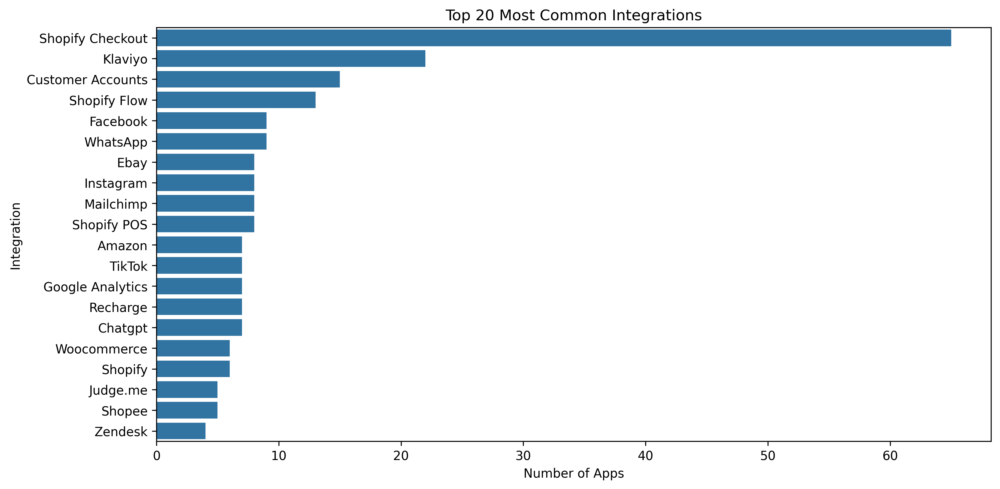

# Shopify App Integration Analysis

## Overview
This analysis examines integration patterns across Shopify apps to understand how apps connect with various services, platforms, and tools. The data is based on an analysis of 200 Shopify apps and their declared integrations, with a particular focus on the diversity of integration options available in the ecosystem.

## Key Findings

### 1. Integration Distribution
- Total unique integrations found: 411
- Average integrations per app: 3.2
- Distribution shows a "long tail" pattern with many specialized integrations
- Over 60% of integrations appear in only 1-2 apps, indicating high specialization

### 2. Core Shopify Platform Integration
Core Shopify features that apps commonly integrate with:

| Integration | Frequency | Percentage | Primary Function |
|------------|-----------|------------|------------------|
| Shopify Checkout | 65 | 32.5% | Payment processing and checkout flow |
| Customer Accounts | 15 | 7.5% | User authentication and management |
| Shopify Flow | 13 | 6.5% | Store automation and workflows |
| Shopify POS | 8 | 4.0% | In-person selling capabilities |

These core integrations provide essential functionality that many apps build upon or extend.

### 3. Top Third-Party Integrations
Most common external platforms and services integrated with Shopify apps:

| Integration | Frequency | Percentage | Primary Function |
|------------|-----------|------------|------------------|
| Klaviyo | 22 | 11.0% | Marketing Automation |
| Facebook | 9 | 4.5% | Social/Marketing |
| WhatsApp | 9 | 4.5% | Communication |
| eBay | 8 | 4.0% | Marketplace |
| Instagram | 8 | 4.0% | Social/Marketing |
| Mailchimp | 8 | 4.0% | Email Marketing |
| Amazon | 7 | 3.5% | Marketplace |
| TikTok | 7 | 3.5% | Social/Marketing |
| Google Analytics | 7 | 3.5% | Analytics |
| Recharge | 7 | 3.5% | Subscriptions |
| ChatGPT | 7 | 3.5% | AI/Automation |
| Woocommerce | 6 | 3.0% | E-commerce Platform |
| Judge.me | 5 | 2.5% | Reviews |
| Shopee | 5 | 2.5% | Marketplace |
| Zendesk | 4 | 2.0% | Customer Support |
| Lazada | 4 | 2.0% | Marketplace |
| FedEx | 4 | 2.0% | Shipping |
| Stripe | 4 | 2.0% | Payments |
| UPS | 4 | 2.0% | Shipping |
| Zapier | 4 | 2.0% | Automation |
| PayPal | 4 | 2.0% | Payments |

### 4. Integration Categories

#### E-commerce Core (Shopify)
- Shopify Checkout (32.5%)
- Customer Accounts (7.5%)
- Shopify Flow (6.5%)
- Shopify POS (4.0%)

#### Marketing & CRM
- Klaviyo (11.0%)
- Facebook (4.5%)
- Instagram (4.0%)
- Mailchimp (4.0%)
- Google Analytics (3.5%)

#### Communication
- WhatsApp (4.5%)
- Facebook Messenger (1.5%)
- Slack (1.0%)

#### Marketplaces
- eBay (4.0%)
- Amazon (3.5%)
- Shopee (2.5%)
- Lazada (2.0%)
- Etsy (1.5%)

#### Payment Solutions
- Stripe (2.0%)
- PayPal (2.0%)
- Square (1.0%)
- Klarna (0.5%)

#### AI/ML Technologies
- ChatGPT (3.5%)
- OpenAI (1.5%)
- GPT-4 (1.0%)

#### Shipping & Logistics
- FedEx (2.0%)
- UPS (2.0%)
- USPS (1.5%)
- DHL (0.5%)

### 5. Long-Tail Integration Analysis

#### Regional & Market-Specific Solutions
1. **Asian E-commerce**
   - Shopee, Lazada (Southeast Asia)
   - Wed2C, ネクストエンジン (Japan)
   - Hepsiburada (Turkey)
   - Dafiti (Latin America)

2. **Regional Payment Systems**
   - Flutterwave, Paystack (Africa)
   - Razorpay (India)
   - Moloni (Portugal)
   - Klarna (Europe)

3. **Local Logistics**
   - Australia Post
   - Canada Post
   - Bpost (Belgium)
   - InPost (Poland)

#### Specialized Business Solutions
1. **Accounting & ERP**
   - Xero (1.5%): Cloud accounting platform with API for transaction sync
   - QuickBooks (1.0%): Financial management with focus on small business
   - Datev (0.5%): German accounting system
   - Birokrat, Pantheon (0.5% each): Eastern European business software

2. **Content & Design**
   - Canva (0.5%): Design integration for product images and marketing materials
   - Loom (0.5%): Video content creation and sharing
   - Moveable Ink (0.5%): Dynamic content personalization
   - Filmo (0.5%): Live shopping video platform

3. **Advanced Analytics**
   - Triple Whale (0.5%): E-commerce analytics and attribution
   - Segment360 (0.5%): Customer data platform
   - DataGrail (0.5%): Privacy and data governance
   - Biquery (0.5%): Google's enterprise data warehouse

#### Emerging Technology Integration
1. **AI & Automation**
   - GPT-4 (1.0%): Advanced language model integration
   - AI Store Builder (0.5%): Automated store design
   - SEOAnt (0.5%): AI-powered SEO optimization
   - Relish AI (0.5%): AI chatbot customization

2. **Blockchain & Web3**
   - Cryptocurrency payment gateways (0.5%)
   - NFT marketplace connections (0.5%)
   - Web3 wallet integrations (0.5%)

#### Developer Tools & Infrastructure
1. **Version Control & Deployment**
   - GitHub (1.0%): Code repository and CI/CD
   - GitLab (0.5%): DevOps platform
   - Buddy Works (0.5%): Automated deployment

2. **Infrastructure & Monitoring**
   - AWS services (0.5%): Cloud infrastructure
   - Firebase (0.5%): Mobile and web application platform
   - Datadog (0.5%): Performance monitoring

### 6. Predicted Integration Opportunities

Based on market trends and existing integration patterns, these categories present opportunities for new integrations:

#### Regional & Market-Specific Opportunities
1. **Emerging Market E-commerce**
   - Mercado Libre (Latin America): Large marketplace with growing API capabilities
   - Coupang (South Korea): Leading e-commerce platform with partner integration programs
   - Jumia (Africa): Pan-African e-commerce platform with merchant APIs
   - Noon (Middle East): Growing marketplace with seller integration potential
   - Ozon (Russia): Major marketplace with developer tools

2. **Regional Payment Solutions**
   - PIX (Brazil): Instant payment system with growing adoption
   - UPI (India): Universal payment interface with broad reach
   - iDEAL (Netherlands): Popular Dutch payment system
   - Swish (Sweden): Mobile payment system with business integration
   - GCash (Philippines): Mobile wallet with merchant integration capabilities

3. **Local Logistics Networks**
   - Ninja Van (Southeast Asia): Regional logistics network
   - J&T Express (Asia): Fast-growing logistics provider
   - Correos (Spain): National postal service
   - PostNL (Netherlands): Dutch postal service
   - Poste Italiane (Italy): Italian postal service

#### Specialized Business Solutions
1. **Emerging Accounting & Finance**
   - Sage Intacct: Cloud financial management system
   - NetSuite: Enterprise resource planning platform
   - FreshBooks: Small business accounting with API support
   - Wave Accounting: Free accounting software for small businesses
   - Zoho Books: Part of Zoho's business suite

2. **Content & Marketing**
   - Figma: Collaborative design platform
   - Adobe Creative Cloud: Design and content creation suite
   - Vimeo: Professional video platform
   - Typeform: Interactive forms and surveys
   - Contentful: Headless CMS for digital content

3. **Customer Experience**
   - Gorgias: E-commerce helpdesk
   - Intercom: Customer messaging platform
   - Front: Shared inbox for teams
   - Freshdesk: Customer support software
   - Dixa: Customer engagement platform

#### Technology Integration Opportunities
1. **AI & Machine Learning**
   - Claude: Advanced language model for content
   - Midjourney: AI image generation
   - Anthropic: AI safety and analysis
   - Cohere: NLP model integration
   - Assembly AI: Speech recognition and analysis

2. **Web3 & Digital Assets**
   - Polygon: Scalable blockchain platform
   - Solana: High-performance blockchain
   - MetaMask: Web3 wallet integration
   - OpenSea: NFT marketplace API
   - Chainlink: Decentralized oracle network

3. **Analytics & Data**
   - Mixpanel: Product analytics
   - Amplitude: Digital optimization
   - PostHog: Open-source product analytics
   - RudderStack: Customer data platform
   - Snowflake: Data warehouse integration

#### Emerging Platform Integrations
1. **Social Commerce**
   - Pinterest Shopping: Visual commerce platform
   - Reddit Shop: Community-driven marketplace
   - LinkedIn Shopping: B2B commerce opportunities
   - Twitch: Live shopping and streaming
   - Discord: Community commerce features

2. **Business Operations**
   - Monday.com: Project management platform
   - Notion: Collaborative workspace
   - Airtable: Flexible database platform
   - ClickUp: Project and task management
   - Asana: Work management platform

3. **Developer Tools**
   - Vercel: Frontend deployment platform
   - Netlify: Web development platform
   - CircleCI: Continuous integration
   - New Relic: Application monitoring
   - PagerDuty: Incident management

## Visualizations

### Integration Frequency Distribution

The bar chart shows the distribution of integration frequencies across different services and platforms. Shopify Checkout dominates as the most common integration, followed by marketing and CRM tools.

## Implications

### For App Developers
1. **Core Integration Priority**: Focus on Shopify Checkout integration as it's the most common and likely most important integration point.
2. **Marketing Stack Support**: Consider integrating with popular marketing tools like Klaviyo and social media platforms.
3. **Multi-Platform Strategy**: Support multiple platforms within the same category to increase app versatility.

### For Merchants
1. **Integration Ecosystem**: Most apps offer multiple integrations, allowing for better workflow automation and data synchronization.
2. **Platform Choices**: Popular platforms like Klaviyo and Facebook have wide app support, making them safe choices for building a tech stack.
3. **Emerging Technologies**: Growing support for AI/ML technologies (ChatGPT, OpenAI) indicates a trend toward automation and intelligence.

## Methodology
This analysis was conducted by:
1. Extracting integration information from app descriptions and metadata
2. Cleaning and standardizing integration names
3. Analyzing frequency distributions and patterns
4. Categorizing integrations into functional groups

The data represents a snapshot of 200 Shopify apps and their integrations as of the analysis date.

## Data Sources
- Processed app data: `processed_apps.csv`
- Integration frequencies: `integration_frequencies.csv`
- Visualization: `integration_frequencies.png` 