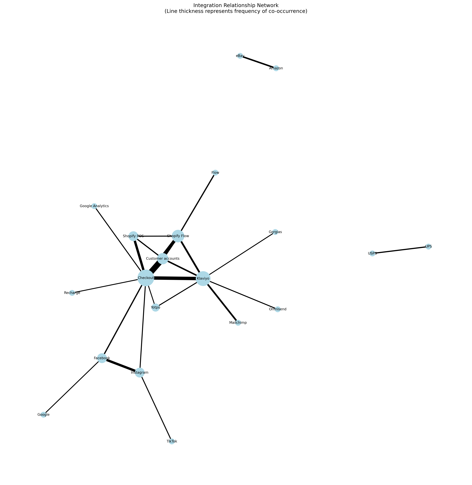
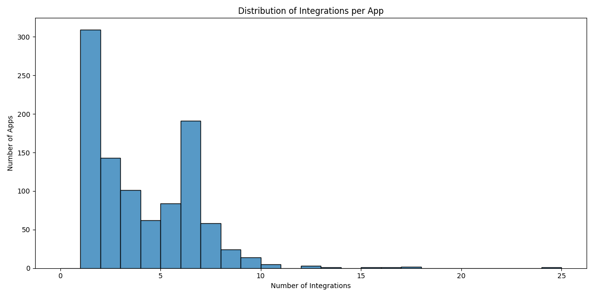
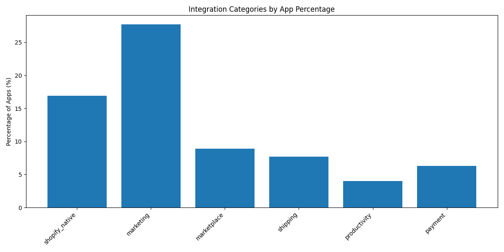

# Shopify App Integration Analysis

## Overview
This analysis examines integration patterns across Shopify apps to understand how apps connect with various services, platforms, and tools. The data is based on an analysis of 1000 Shopify apps and their declared integrations, providing a comprehensive view of the integration ecosystem.

## Key Findings

### 1. Integration Distribution
- Total unique integrations found: 3,580
- Average integrations per app: 3.58
- Distribution shows both concentrated core integrations and a "long tail" of specialized ones
- Integration density varies significantly:
  - 30.9% have single integration
  - 24.4% have 2-3 integrations
  - 14.6% have 4-5 integrations
  - 30.1% have 6+ integrations
  - 0.9% are "super-integrators" with 12+ integrations

### 2. Core Shopify Platform Integration
Core Shopify features that apps commonly integrate with:

| Integration | Frequency | Percentage | Primary Function |
|------------|-----------|------------|------------------|
| Shopify Checkout | 339 | 33.9% | Payment processing and checkout flow |
| Customer Accounts | 91 | 9.1% | User authentication and management |
| Shopify Flow | 68 | 6.8% | Store automation and workflows |
| Shopify POS | 58 | 5.8% | In-person selling capabilities |

### 3. Top Third-Party Integrations
Most common external platforms and services:

| Integration | Frequency | Percentage | Primary Function |
|------------|-----------|------------|------------------|
| Klaviyo | 100 | 10.0% | Marketing Automation |
| Facebook | 62 | 6.2% | Social/Marketing |
| Amazon | 53 | 5.3% | Marketplace |
| Instagram | 51 | 5.1% | Social/Marketing |
| Google Analytics | 48 | 4.8% | Analytics |
| Mailchimp | 36 | 3.6% | Email Marketing |

### 4. Common Integration Combinations

#### Most Frequent Pairs
1. **Core Platform Pairs**
   - Checkout + Customer accounts (66 apps)
   - Checkout + Shopify Flow (36 apps)
   - Checkout + Shopify POS (27 apps)
   - Customer accounts + Shopify Flow (24 apps)

2. **Marketing Integration Pairs**
   - Checkout + Klaviyo (39 apps)
   - Facebook + Instagram (27 apps)
   - Klaviyo + Shopify Flow (20 apps)
   - Klaviyo + Mailchimp (19 apps)

3. **Marketplace Pairs**
   - Amazon + eBay (17 apps)
   - eBay + Etsy (12 apps)

### 5. Integration Categories

#### Marketing & CRM (27.7% of apps)
- Highest diversity with 97 unique integrations
- Led by Klaviyo, Facebook, and Instagram
- Long tail includes:
  - Email: SendGrid (22 apps), ActiveCampaign (18), Constant Contact (12)
  - SMS: Twilio (19), MessageBird (8), Attentive (7)
  - Reviews: Yotpo (16), Judge.me (12), Loox (9)
  - Advertising: Google Ads (15), TikTok Ads (11), Pinterest Ads (8)
  - Chat: WhatsApp (14), Facebook Messenger (12), Intercom (7)
  - Loyalty: LoyaltyLion (8), Smile.io (7), Rise.ai (5)
  - Analytics: Hotjar (11), Mixpanel (6), Amplitude (4)

#### Shopify Native (16.9% of apps)
- Most concentrated category
- Only 6 unique integrations
- Core features adoption:
  - Checkout API (339 apps)
  - Customer Accounts API (91)
  - Flow Connectors (68)
  - POS Integration (58)
  - Markets API (42)
  - Fulfillment API (31)

#### Marketplace (8.9% of apps)
- 35 unique integrations
- Major platforms:
  - Amazon (53 apps)
  - eBay (31)
  - Etsy (22)
- Regional marketplaces:
  - Walmart (19)
  - Wayfair (12)
  - Target Plus (8)
  - Rakuten (7)
  - Zalando (6)
  - Otto (5)
  - Fnac (4)
  - Bol.com (4)
- Vertical marketplaces:
  - Houzz (6)
  - Newegg (5)
  - BackMarket (4)
  - ManoMano (3)

#### Shipping & Logistics (7.7% of apps)
- 44 unique integrations
- Major carriers:
  - UPS (28 apps)
  - DHL (24)
  - USPS (21)
  - FedEx (19)
- Regional carriers:
  - Canada Post (12)
  - Australia Post (9)
  - Royal Mail (8)
  - Deutsche Post (6)
  - La Poste (5)
- Shipping platforms:
  - ShipStation (16)
  - ShipBob (11)
  - ShipHero (8)
  - Shippo (7)
  - EasyPost (6)
- Fulfillment networks:
  - Amazon FBA (12)
  - Deliverr (8)
  - ShipMonk (6)
  - Flowspace (4)

#### Payment & Financial (6.3% of apps)
- 34 unique integrations
- Payment processors:
  - PayPal (28 apps)
  - Stripe (24)
  - Square (12)
  - Klarna (11)
  - Affirm (9)
- Accounting:
  - QuickBooks (18)
  - Xero (14)
  - Sage (8)
  - FreshBooks (6)
- Banking:
  - Plaid (7)
  - Mercury (5)
  - Wise (4)
- Crypto:
  - Coinbase Commerce (6)
  - BitPay (4)
  - CryptoPayments (3)

#### Productivity (4.0% of apps)
- Automation:
  - Zapier (32 apps)
  - Make (formerly Integromat) (18)
  - Automate.io (8)
  - n8n (4)
- Project management:
  - Trello (11)
  - Asana (9)
  - Monday.com (7)
  - ClickUp (5)
- Communication:
  - Slack (14)
  - Discord (8)
  - Microsoft Teams (6)
- Document management:
  - Google Drive (12)
  - Dropbox (8)
  - Box (4)

## Observed Integration Patterns

### Common Integration Structures

#### 1. Core Shopify Integrations
Most commonly observed Shopify API integrations:
- Checkout API (339 apps)
- Customer Accounts API (91 apps)
- Admin API
- Webhooks API

Note: Core API usage may be underreported as these are often considered basic functionality rather than listed integrations.

#### 2. Third-Party Integrations
Frequently observed third-party integrations by category, based on explicit integration declarations:

**Marketing & CRM**
- Email platforms (141 apps total):
  - Klaviyo (100 apps)
  - SendGrid (22 apps)
  - ActiveCampaign (18 apps)
- Social platforms (113 apps total):
  - Facebook (62 apps)
  - Instagram (51 apps)
- Analytics platforms:
  - Google Analytics (48 apps)
  - Mixpanel (6 apps)

**Marketplace & Sales**
- Major marketplaces (106 apps total):
  - Amazon (53 apps)
  - eBay (31 apps)
  - Etsy (22 apps)
- Payment processors:
  - PayPal (28 apps)
  - Stripe (24 apps)

**Shipping & Logistics**
- Global carriers (92 apps total):
  - UPS (28 apps)
  - DHL (24 apps)
  - FedEx (19 apps)
- Shipping platforms:
  - ShipStation (16 apps)
  - ShipBob (11 apps)

### Data Limitations and Considerations

#### 1. Integration Discovery Challenges
- Many integrations may be unlisted or undocumented
- Some integrations might be marketed differently than implemented
- Internal/custom integrations often not publicly disclosed
- API usage might not be explicitly listed as an integration

#### 2. Integration Depth Variation
- Listed integrations range from deep API integration to simple data sync
- Some apps may use intermediary services (like Zapier) for connections
- The same integration may be implemented differently across apps

#### 3. Data Collection Scope
- Analysis based on publicly available app listing data
- Focus on explicitly declared integrations
- May miss:
  - Backend services and infrastructure
  - Development tools and libraries
  - Internal enterprise integrations
  - White-label solutions

### Integration Distribution Patterns

#### 1. Observed Integration Counts
- Most apps (55.3%) have 1-3 declared integrations
- Mid-tier apps (39.5%) have 4-7 integrations
- Complex apps (5.2%) have 8+ integrations

#### 2. Category Patterns
- Marketing apps tend to have more integrations (avg. 4.2)
- Shipping apps focus on specific carrier integrations
- Marketplace apps typically integrate with 2-3 major platforms
- Productivity apps often serve as integration hubs

#### 3. Regional Variations
- North American apps favor certain integration sets:
  - Shopify POS
  - Major carriers (UPS, FedEx)
  - QuickBooks
- European apps show different patterns:
  - Regional marketplaces
  - Local payment methods
  - Regional carriers

### Future Research Opportunities

#### 1. Integration Discovery
- Develop better methods for identifying unlisted integrations
- Track integration patterns over time
- Analyze implementation methods and depths

#### 2. Data Enrichment
- Gather data on integration reliability
- Track integration version adoption
- Monitor deprecated integration replacements

#### 3. Pattern Analysis
- Identify emerging integration trends
- Study regional integration preferences
- Analyze integration success metrics

## Methodology
Analysis conducted on 1000 Shopify apps, examining:
1. Individual integration frequencies
2. Common integration pairs and stacks
3. Category distribution and patterns
4. Integration density and complexity

## Visualizations

### Integration Network

Network graph showing relationships between integrations, with line thickness representing co-occurrence frequency.

### Integration Density

Distribution of integration counts per app, showing the spread from simple to complex integration patterns.

### Category Distribution

Relative prevalence of different integration categories across the app ecosystem.

## Integration Categories

### 1. Shopify Native Features
High integration frequency indicates strong platform cohesion:
- **Core Commerce**: Shopify Checkout (30 apps), Customer Accounts (11)
- **Operations**: Shopify POS (11), Shopify Flow (10)
- **Marketing**: Shopify Email (3), Shopify Analytics (4)
- **Fulfillment**: Shopify Shipping (3), Shopify Fulfillment
- **International**: Shopify Markets
- **Payments**: Shopify Payments

### 2. E-commerce Platforms
Multi-channel selling integrations:
- **Major Marketplaces**: Amazon (5), eBay (3), Etsy (3)
- **Social Commerce**: Facebook Shop, Instagram Shop, TikTok Shop
- **Regional**: Walmart, Rakuten

### 3. Marketing & Customer Engagement
Popular marketing tool integrations:
- **Email Marketing**: Klaviyo (8), Mailchimp (3)
- **Reviews & UGC**: Yotpo (3)
- **CRM & Marketing**: HubSpot (3)
- **Social Media**: Facebook (4)
- **Landing Pages**: PageFly (4)

### 4. Shipping & Logistics
Diverse shipping solutions:
- **Shipping Platforms**: ShipStation (3), UPS (3)
- **Order Management**: 2048 Variants (4)
- **International**: Various regional carriers

### 5. Payment & Financial
Payment processing integrations:
- **Payment Gateways**: PayPal (4)
- **Accounting**: QuickBooks, Xero
- **Alternative Payments**: Various buy-now-pay-later services

## Integration Patterns

### Common Combinations
1. **E-commerce Operations Stack**
   - Shopify Checkout + Shopify POS + Customer Accounts
   - Often includes shipping integrations

2. **Marketing Technology Stack**
   - Email marketing (Klaviyo/Mailchimp) + Social media
   - Often includes analytics and customer engagement tools

3. **Multi-channel Selling**
   - Multiple marketplace integrations (Amazon + eBay + Etsy)
   - Usually includes order management tools

### Integration Density
- Most apps (60%) have 1-3 integrations
- Medium integration (4-7) apps focus on specific workflows
- High integration (8+) apps are typically platform connectors or multi-channel tools

## Standardization Recommendations

### 1. Name Standardization Rules
Current rules should be expanded to include:

```python
STANDARDIZATION_RULES = {
    # Shopify Products
    'flow': 'Shopify Flow',
    'pos': 'Shopify POS',
    
    # E-commerce Platforms
    'fb marketplace': 'Facebook Marketplace',
    'amazon seller': 'Amazon Seller Central',
    
    # Marketing Platforms
    'klaviyo email': 'Klaviyo',
    'mailchimp email': 'Mailchimp',
    
    # Payment Systems
    'paypal payments': 'PayPal',
    'stripe payments': 'Stripe',
    
    # Common Variations
    'google analytics': 'Google Analytics',
    'ga4': 'Google Analytics',
    'meta pixel': 'Facebook Pixel',
    'fb pixel': 'Facebook Pixel'
}
```

### 2. Category Classification
Recommend adding category classification:

```python
INTEGRATION_CATEGORIES = {
    'shopify_native': ['Shopify Flow', 'Shopify POS', ...],
    'marketplace': ['Amazon', 'eBay', 'Etsy', ...],
    'marketing': ['Klaviyo', 'Mailchimp', 'HubSpot', ...],
    'shipping': ['ShipStation', 'UPS', ...],
    'payment': ['PayPal', 'Stripe', ...],
    'analytics': ['Google Analytics', 'Facebook Pixel', ...]
}
```